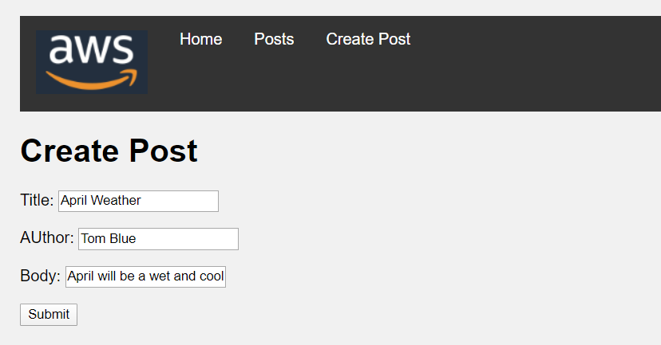

# Creating an AWS Blog Application using Spring Boot and DynamoDB

You can develop a fully functioning blog application by using AWS Services (DynamoDB and Elastic Beanstalk) and Spring Boot. This application uses AWS Java APIs to insert and retrieve data from a DynamoDB table and then Spring Boot APIs to build a model, view and controllers. To query data from the DynamoDB table, you use a <code>com.amazonaws.services.dynamodbv2.AmazonDynamoDB</code> instance that belongs to the DynamoDB Java API. This API supports both inserting and querying operations.

The following illustration shows the application that is developed by following this document.

This application also displays the five most recent posts. When a user clicks on a post, its details are retrieved and displayed, as shown in this illustration.

In addition, new posts can be created by clicking the Create Post menu option. When the post is submitted to a Spring controller, the data is persisted into a DynamoDB table named Blogs.

This development document guides you through creating an AWS application that uses Spring Boot. Once the application is developed, this document teaches you how to deploy it to the AWS Elastic Beanstalk.

To follow along with the document, you require the following:

+ An AWS Account.
+ A Java IDE (for this example, IntelliJ is used).
+ Java 1.8 SDK and Maven.

The following illustration shows the project that is created.

## Create an IntelliJ Project named AWS Blog
The following example generates a presigned URL that you can give to others so that they can retrieve an object from an S3 bucket.

// Create an S3Presigner using the default region and credentials.

 // This is usually done at application startup, because creating a presigner can be expensive.

 S3Presigner presigner = S3Presigner.create();

 // Create a GetObjectRequest to be pre-signed

 GetObjectRequest getObjectRequest =

         GetObjectRequest.builder()

                         .bucket(&quot;my-bucket&quot;)

                         .key(&quot;my-key&quot;)

                         .build();

 // Create a GetObjectPresignRequest to specify the signature duration

 GetObjectPresignRequest getObjectPresignRequest =

     GetObjectPresignRequest.builder()

                            .signatureDuration(Duration.ofMinutes(10))

                            .getObjectRequest(request)

                            .build();

 // Generate the presigned request

 PresignedGetObjectRequest presignedGetObjectRequest =

     presigner.presignGetObject(getObjectPresignRequest);

 // Log the presigned URL, for example.

 System.out.println(&quot;Presigned URL: &quot; + presignedGetObjectRequest.url());

 // It is recommended to close the S3Presigner when it is done being used, because some credential

 // providers (e.g. if your AWS profile is configured to assume an STS role) require system resources

 // that need to be freed. If you are using one S3Presigner per application (as recommended), this

 // usually is not needed.

 presigner.close();
