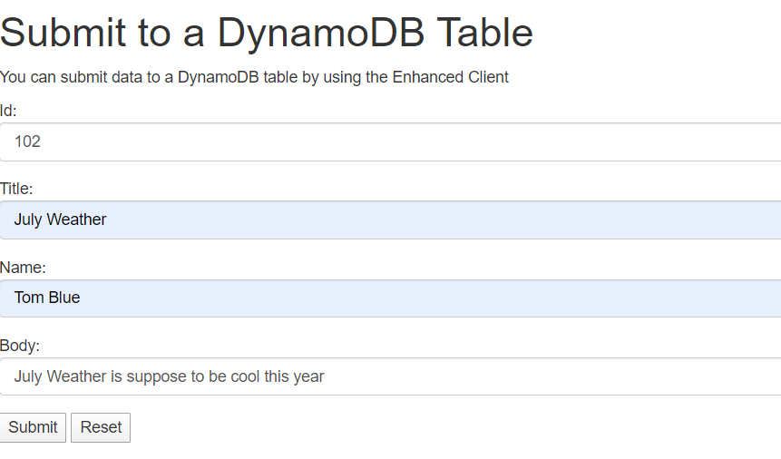
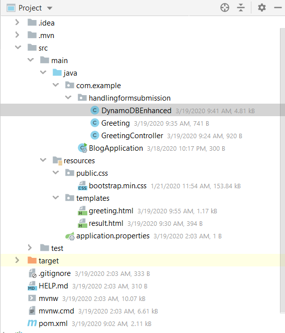
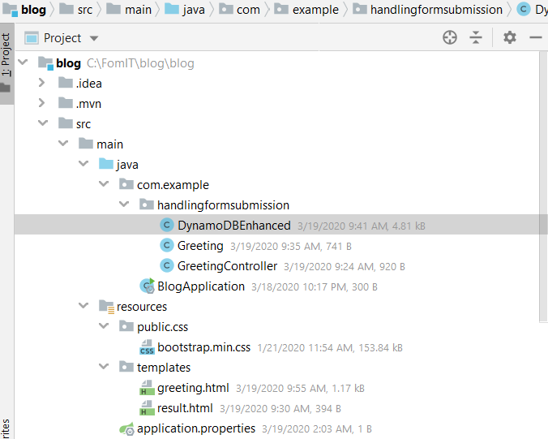

# Submitting data to an Amazon DynamoDB table using the Enhanced Client within a Spring Boot application 

You can develop a fully functioning data submission application by using AWS Services (Amazon DynamoDB and AWS Elastic Beanstalk) and Spring Boot. This application uses the DynamoDB Enhanced Client (**software.amazon.awssdk.enhanced.dynamodb.DynamoDbEnhancedClient**)  to submit data to a DynamoDB table. This application also uses Spring Boot APIs to build a model, views and a controller. 

The DynamoDB Enhanced client lets you map your client-side classes to Amazon DynamoDB tables. To use DynamoDB Enhanced Client, you define the relationship between items in a DynamoDB table and their corresponding object instances in your code. The DynamoDB Enhanced Client class enables you to access your tables; perform various create, read, update, and delete (CRUD) operations; and execute queries.

**Note**: For more information about the DynamoDB Enhanced client, see <X-REF TO Java 2 DEV Guide>. 

The following illustration shows the application that is developed by following this document.

WHen the **Submit** button is clicked, the data is submitted to a Spring Controller and persisted into a DynamoDB table named **Greeting**. The following illustration shows this table. 

This development document guides you through creating an AWS application that uses Spring Boot. Once the application is developed, this document teaches you how to deploy it to the AWS Elastic Beanstalk.

To follow along with the document, you require the following:

+ An AWS Account.
+ A Java IDE (for this example, IntelliJ is used).
+ Java 1.8 SDK and Maven.

The following illustration shows the project that is created.

**Cost to Complete**: The AWS Services included in this document are included in the AWS Free Tier.

**Note**: Please be sure to terminate all of the resources created during this document to ensure that you are no longer charged.

This document contains the following sections: 

+ Create an IntelliJ project named **Greetings**
+ Add the Spring POM dependencies to your project	
+ Setup the Java packages in your project
+ Create the Java logic for the main Boot class
+ Create the HTML files
+ Package the **Greetings** application into a JAR file
+ Setup the DynamoDB table 
+ Deploy the  **Greetings** application to the AWS Elastic Beanstalk

## Create an IntelliJ project named Greetings

**Create a new IntelliJ project named Greetings**

1. From within the IntelliJ IDE, click **File**, **New**, **Project**. 
2. In the **New Project** dialog, select **Maven**. 
3. Click **Next**.
4. In the **GroupId** field, enter **spring-aws**. 
5. In the **ArtifactId** field, enter **Greetings**. 
6. Click **Next**.
7. Click **Finish**. 

## Add the Spring POM dependencies to your project

At this point, you have a new project named **Greetings**, as shown in this illustration. 

Inside the **project** element in the **pom.xml** file, add the **spring-boot-starter-parent** dependency:
  
     <parent>
		  <groupId>org.springframework.boot</groupId>
		  <artifactId>spring-boot-starter-parent</artifactId>
		  <version>2.2.5.RELEASE</version>
		  <relativePath/> <!-- lookup parent from repository -->
	  </parent>
    
Also, add the following Spring Boot **dependency** elements inside the **dependencies** element.

    <dependency>
			<groupId>org.springframework.boot</groupId>
			<artifactId>spring-boot-starter-thymeleaf</artifactId>
		</dependency>
		<dependency>
			<groupId>org.springframework.boot</groupId>
			<artifactId>spring-boot-starter-web</artifactId>
		</dependency>
		 <dependency>
			<groupId>org.springframework.boot</groupId>
			<artifactId>spring-boot-starter-test</artifactId>
			<scope>test</scope>
			<exclusions>
				<exclusion>
					<groupId>org.junit.vintage</groupId>
					<artifactId>junit-vintage-engine</artifactId>
				</exclusion>
			</exclusions>
		  </dependency>
      
In addition, you need to add these DynamoDB API dependencies. 

    <dependencyManagement>
	    	<dependencies>
			  <dependency>
				  <groupId>software.amazon.awssdk</groupId>
				  <artifactId>bom</artifactId>
				  <version>2.10.54</version>
				  <type>pom</type>
				<scope>import</scope>
			</dependency>
		  </dependencies>
	  </dependencyManagement>
    
    <dependency>
			<groupId>software.amazon.awssdk</groupId>
			<artifactId>dynamodb-enhanced</artifactId>
			<version>2.10.84-PREVIEW</version>
		</dependency>
		<dependency>
			<groupId>software.amazon.awssdk</groupId>
			<artifactId>dynamodb</artifactId>
			<version>2.5.10</version>
		</dependency>
    
**Note** - Ensure that you are using Java 1.8 (shown below).
  
At this point, the **pom.xml** file resembles the following file. 

    <?xml version="1.0" encoding="UTF-8"?>
    <project xmlns="http://maven.apache.org/POM/4.0.0"
         xmlns:xsi="http://www.w3.org/2001/XMLSchema-instance"
         xsi:schemaLocation="http://maven.apache.org/POM/4.0.0 http://maven.apache.org/xsd/maven-4.0.0.xsd">
    <modelVersion>4.0.0</modelVersion>
    <groupId>spring-aws</groupId>
    <artifactId>Greetings</artifactId>
    <version>1.0-SNAPSHOT</version>
    <packaging>jar</packaging>
    <parent>
        <groupId>org.springframework.boot</groupId>
        <artifactId>spring-boot-starter-parent</artifactId>
        <version>2.2.5.RELEASE</version>
        <relativePath/> <!-- lookup parent from repository -->
    </parent>

    <properties>
        <java.version>1.8</java.version>
    </properties>
    <dependencyManagement>
        <dependencies>
            <dependency>
                <groupId>software.amazon.awssdk</groupId>
                <artifactId>bom</artifactId>
                <version>2.10.54</version>
                <type>pom</type>
                <scope>import</scope>
            </dependency>
        </dependencies>
    </dependencyManagement>
    <dependencies>
        <dependency>
            <groupId>org.springframework.boot</groupId>
            <artifactId>spring-boot-starter-thymeleaf</artifactId>
        </dependency>
        <dependency>
            <groupId>org.springframework.boot</groupId>
            <artifactId>spring-boot-starter-web</artifactId>
        </dependency>
        <dependency>
            <groupId>org.springframework.boot</groupId>
            <artifactId>spring-boot-starter-test</artifactId>
            <scope>test</scope>
            <exclusions>
                <exclusion>
                    <groupId>org.junit.vintage</groupId>
                    <artifactId>junit-vintage-engine</artifactId>
                </exclusion>
            </exclusions>
        </dependency>
        <dependency>
            <groupId>software.amazon.awssdk</groupId>
            <artifactId>dynamodb-enhanced</artifactId>
            <version>2.10.84-PREVIEW</version>
        </dependency>
        <dependency>
            <groupId>software.amazon.awssdk</groupId>
            <artifactId>dynamodb</artifactId>
            <version>2.5.10</version>
        </dependency>
      </dependencies>
      <build>
        <plugins>
            <plugin>
                <groupId>org.springframework.boot</groupId>
                <artifactId>spring-boot-maven-plugin</artifactId>
            </plugin>
        </plugins>
      </build>
    </project>
 
**Note** - Make sure that you have the <packaging> element in your POM file. This is required to build a JAR file (which is covered later in this document).  
    
## Setup the Java packages in your project

Create a Java package in the **main/java** folder named **com.example.handlingformsubmission**. The Java files go into this package.

The following list describes the Java files in this package.

+ **DynamoDBEnhanced** - contains Java application logic that injects data into a Amazon DynamoDB table using the Enchanced Client. 
+ **Greeting** - A Java class that container setter and getter methods and represents the model for the application.
+ **GreetingController** - A Java class that repeesents the controller for this application. 

**Note**: The **GreetingApplication** class must be placed into the **com.example** package. 

## Create the Java logic for the application

Create Spring application logic that is required for this application to persist data into an Amazon DynamoDB table. You need to create the main Spring Boot Java class, the Controller class, the model class, and the DynamoDB service class. 

### Create the main Spring Boot Java class

In the **com.example** package, create a new Java class named **GreetingApplication**. Add the following Java code to this class. 

	package com.example;

	import org.springframework.boot.SpringApplication;
	import org.springframework.boot.autoconfigure.SpringBootApplication;

	@SpringBootApplication
	public class GreetingApplication {

    	public static void main(String[] args) {
        	SpringApplication.run(GreetingApplication.class, args);
    	 }
	}

### Create the GreetingController class

In the **com.example.handlingformsubmission** package, create the **GreetingController** class. This class functions as the controller for the Spring Boot application. That is, it handles HTTP requests and returns a view. In this example, notice the **@Autowired** annotation. This creates a managed Spring bean. The following Java code represents this class. 

	package com.example.handlingformsubmission;

	import org.springframework.beans.factory.annotation.Autowired;
	import org.springframework.stereotype.Controller;
	import org.springframework.ui.Model;
	import org.springframework.web.bind.annotation.GetMapping;
	import org.springframework.web.bind.annotation.ModelAttribute;
	import org.springframework.web.bind.annotation.PostMapping;

    	@Controller
    	public class GreetingController {

    	@Autowired
    	private DynamoDBEnhanced dde;

    	@GetMapping("/greeting")
    	public String greetingForm(Model model) {
         model.addAttribute("greeting", new Greeting());
         return "greeting";
    	}

    	@PostMapping("/greeting")
    	public String greetingSubmit(@ModelAttribute Greeting greeting) {

        //Persist Greeting into a DynamoDB table using the Enhanced Client
        dde.injectDynamoItem(greeting);

        return "result";
    	 }
	}
	
### Create the Greeting class

In the **com.example.handlingformsubmission** package, create the **Greeting** class. This class functions as the model for the Spring Boot application. The following Java code represents this class.  

	package com.example.handlingformsubmission;

	public class Greeting {
	
	private String id;
    	private String body;
    	private String name;
    	private String title;

    	public String getTitle() {
        	return this.title;
    	}

    	public void setTitle(String title) {
        	this.title = title;
    	}

    	public String getName() {
        	return this.name;
    	}

    	public void setName(String name) {
        	this.name = name;
    	}

    	public String getId() {
        	return id;
    	}

    	public void setId(String id) {
        	this.id = id;
    	}

    	public String getBody() {
        	return this.body;
    	}

    	public void setBody(String body) {
        	this.body = body;
    	}
       }
	
### Create the DynamoDBEnhanced class

In the **com.example.handlingformsubmission** package, create the **DynamoDBEnhanced** class. This class uses the DynamoDB API that injects data into a DynamoDB table by using the Enhanced client. To map data to the table, you use a **TableSchema** object (as shown in the following example). In this example, notice the **GreetingItems** class where each data member is mapped to a column in a DynamoDB table. 

To inject data into a DynamoDB table, you create a **DynamoDbTable** object by invoking the **DynamoDbEnhancedClient** object's **table** method and passing the table name (in this example, **Greeting**) and the **TableSchema** object. Next, create a **GreetingItems** object and populate it with data values that you want to store (in this example, the data items are submitted from the Spring form). 

Create a **PutItemEnhancedRequest** object and pass the **GreetingItems** object for the **items** method. Finally invoke the the **DynamoDbEnhancedClient** object's **putItem** method and pass the **PutItemEnhancedRequest** object. The following Java code represents the **DynamoDBEnhanced** class.

	package com.example.handlingformsubmission;

	import static software.amazon.awssdk.enhanced.dynamodb.mapper.StaticAttributeTags.primaryPartitionKey;
	import software.amazon.awssdk.enhanced.dynamodb.DynamoDbEnhancedClient;
	import software.amazon.awssdk.enhanced.dynamodb.DynamoDbTable;
	import software.amazon.awssdk.enhanced.dynamodb.TableSchema;
	import software.amazon.awssdk.enhanced.dynamodb.mapper.StaticTableSchema;

	import software.amazon.awssdk.enhanced.dynamodb.model.PutItemEnhancedRequest;
	import software.amazon.awssdk.regions.Region;
	import software.amazon.awssdk.services.dynamodb.DynamoDbClient;
	import software.amazon.awssdk.services.dynamodb.model.ProvisionedThroughput;
	import org.springframework.stereotype.Component;

	@Component("DynamoDBEnhanced")
	public class DynamoDBEnhanced {

    	private final ProvisionedThroughput DEFAULT_PROVISIONED_THROUGHPUT =
            ProvisionedThroughput.builder()
                    .readCapacityUnits(50L)
                    .writeCapacityUnits(50L)
                    .build();

    	private final TableSchema<GreetingItems> TABLE_SCHEMA =
            StaticTableSchema.builder(GreetingItems.class)
                    .newItemSupplier(GreetingItems::new)
                    .addAttribute(String.class, a -> a.name("idblog")
                            .getter(GreetingItems::getId)
                            .setter(GreetingItems::setId)
                            .tags(primaryPartitionKey()))
                    .addAttribute(String.class, a -> a.name("author")
                            .getter(GreetingItems::getName)
                            .setter(GreetingItems::setName))
                    .addAttribute(String.class, a -> a.name("title")
                            .getter(GreetingItems::getTitle)
                            .setter(GreetingItems::setTitle))
                    .addAttribute(String.class, a -> a.name("body")
                            .getter(GreetingItems::getMessage)
                            .setter(GreetingItems::setMessage))
                    .build();

    	// Uses the Enhanced Client to inject a new post into a DynamoDB table
    	public void injectDynamoItem(Greeting item){

        Region region = Region.US_EAST_1;
        DynamoDbClient ddb = DynamoDbClient.builder()
                .region(region)
                .build();

        try {

            DynamoDbEnhancedClient enhancedClient = DynamoDbEnhancedClient.builder()
                    .dynamoDbClient(ddb)
                    .build();

            //Create a DynamoDbTable object
            DynamoDbTable<GreetingItems> mappedTable = enhancedClient.table("Greeting", TABLE_SCHEMA);
            GreetingItems gi = new GreetingItems();
            gi.setName(item.getName());
            gi.setMessage(item.getBody());
            gi.setTitle(item.getTitle());
            gi.setId(item.getId());

            PutItemEnhancedRequest enReq = PutItemEnhancedRequest.builder(GreetingItems.class)
                    .item(gi)
                    .build();

            mappedTable.putItem(enReq);

        } catch (Exception e) {
            e.getStackTrace();
        }
    	}

	 public class GreetingItems {

        //Set up Data Members that correspond to columns in the Work table
        private String id;
        private String name;
        private String message;
        private String title;

        public GreetingItems()
        {
        }

        public String getId() {
            return this.id;
        }

        public void setId(String id) {
            this.id = id;
        }

        public String getName() {
            return this.name;
        }

        public void setName(String name) {
            this.name = name;
        }

        public String getMessage(){
            return this.message;
        }

        public void setMessage(String message){
            this.message = message;
        }

        public String getTitle() {
            return this.title;
        }

        public void setTitle(String title) {
            this.title = title;
	       }
	   }
	}
	
## Create the HTML files

At this point, you have created all of the Java files required for the AWS *Greeting Application*. Under the resource folder, create a **templates** folder and then create the following HTML files:

+ **greeting.html**
+ **result.html**

The following illustration shows these files. 

The **greeting.html** file is the form that lets a user submit data to the **GreetingController**. This form uses Spring Thymeleaf, which is Java template technology and can be used in Spring Boot applications. A benefit of using Spring Thymeleaf is you can submit form data as objects to Spring Controllers.  For more information, see https://www.thymeleaf.org/.

The **result.html** file is used as a view returned by the controller after the user submits the data. In this example, it simply displays the Id value and the message. By the time the view is displayed, the data is already persisted in the DynamoDB table. 

#### Greeting HTML file

The following HTML code represents the **greeting.html** file. 

	<!DOCTYPE HTML>
	<html xmlns:th="https://www.thymeleaf.org">
	<head>
   	 <title>Getting Started: Spring Boot and the Enhanced DynamoDB Client</title>
    	<meta http-equiv="Content-Type" content="text/html; charset=UTF-8" />

    	<link rel="stylesheet" href="../public/css/bootstrap.min.css" th:href="@{/css/bootstrap.min.css}" />
	</head>
	<body>
	
	<h1>Submit to a DynamoDB Table</h1>
	
You can submit data to a DynamoDB table by using the Enhanced Client

	<form action="#" th:action="@{/greeting}" th:object="${greeting}" method="post">
    	

    	
Id: <input type="text"  class="form-control" th:field="*{id}" />

    <	/div>

    	

    	
Title: <input type="text" class="form-control" th:field="*{title}" />

    	

    	

     	
Name: <input type="text" class="form-control" th:field="*{name}" />

    	

    	

        
Body: <input type="text" class="form-control" th:field="*{body}"/>

    	

        
<input type="submit" value="Submit" /> <input type="reset" value="Reset" />

	</form>

	</body>
	</html>

**Note** - Notice that the **th:field** values correspond to the data members in the **Greeting** class. 

#### Result HTML file

The following HTML code represents the **result.html** file. 

	<!DOCTYPE HTML>
	<html xmlns:th="https://www.thymeleaf.org">
	<head>
    	 <title>Getting Started: Handling Form Submission</title>
      	  <meta http-equiv="Content-Type" content="text/html; charset=UTF-8" />
	 </head>
	<body>
	<h1>Result</h1>
	

	

	<a href="/greeting">Submit another message</a>
	</body>
	</html>

#### Create the HTML files 

1. In the **resources** folder, create a new folder named **templates**. 
2. In the **templates** folder, create the **greeting.html** file and paste the HTML code into this file. 
3. In the **templates** folder, create the **result.html** file and paste the HTML code into this file.   

## Create a JAR file for the Greetings application

You can package up the project into a JAR file that you can deploy to Amazon Elastic Beanstalk. To package up the project, you can use the following Maven command.

	mvn package

The JAR is located in the target folder, as shown in the following illustration.

## Create the DynamoDB table named Greeting

You can use the DynamoDB Java API to create a table. The code to create a table is listed at this URL.

https://github.com/awsdocs/aws-doc-sdk-examples/blob/master/javav2/example_code/dynamodb/src/main/java/com/example/dynamodb/CreateTable.java

Do not include the **CreateTable** class in this Spring project. You can setup a separate Java project to run this code. Ensure that you name the table **Greeting** when you execute this Java code (this is referenced in the **DynamoDBEnhanced** class). 

## Deploy the application to the AWS Elastic Beanstalk

Sign in to the AWS Management Console, and then open the Elastic Beanstalk console. An application is the top-level container in Elastic Beanstalk that contains one or more application environments (for example prod, qa, and dev or prod-web, prod-worker, qa-web, qa-worker).

If this is your first time accessing this service, you will see a *Welcome to AWS Elastic Beanstalk* page. Otherwise, you’ll land on the Elastic Beanstalk dashboard, which lists all of your applications.

To deploy the *AWS Tracker* application to the AWS Elastic Beanstalk:

1. Choose **Create New Application**. This opens a wizard that creates your application and launches an appropriate environment.
2. In the *Create New Application* dialog, enter the following values: 
+ **Application Name** - AWSItemTracker
+ **Description** - A description for the application. 

NOTE - To change the port that Spring Boot listens on, add a new environment variable, SERVER_PORT, with the value 5000.
