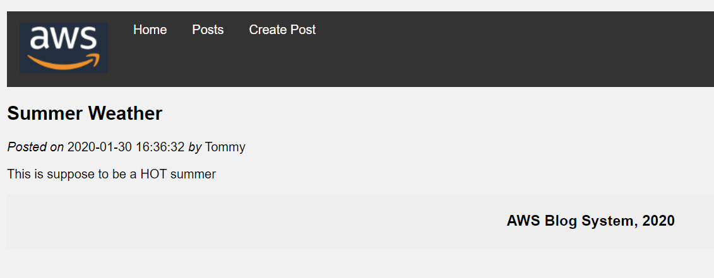

# Submitting data to an Amazon DynamoDB table using the Enhanced Client within a Spring Boot application 

You can develop a fully functioning data submission application by using AWS Services (Amazon DynamoDB and AWS Elastic Beanstalk) and Spring Boot. This application uses the DynamoDB Enhanced Client (**software.amazon.awssdk.enhanced.dynamodb.DynamoDbEnhancedClient**) s to submit data to a DynamoDB table. This application also uses Spring Boot APIs to build a model, view and controllers. 

The DynamoDB Enhanced client lets you map your client-side classes to Amazon DynamoDB tables. To use DynamoDB Enhanced Client, you define the relationship between items in a DynamoDB table and their corresponding object instances in your code. The DynamoDB Enhanced Client class enables you to access your tables; perform various create, read, update, and delete (CRUD) operations; and execute queries.

Note: For more information about the DynamoDB Enhanced client, see <X-REF TO Java 2 DEV Guide>. 

The following illustration shows the application that is developed by following this document.

This application also displays the five most recent posts. When a user clicks on a post, its details are retrieved and displayed, as shown in this illustration.

In addition, new posts can be created by clicking the Create Post menu option. When the post is submitted to a Spring controller, the data is persisted into a DynamoDB table named Blogs.

This development document guides you through creating an AWS application that uses Spring Boot. Once the application is developed, this document teaches you how to deploy it to the AWS Elastic Beanstalk.

To follow along with the document, you require the following:

+ An AWS Account.
+ A Java IDE (for this example, IntelliJ is used).
+ Java 1.8 SDK and Maven.

The following illustration shows the project that is created.

**Cost to Complete**: The AWS Services included in this document are included in the AWS Free Tier.

**Note**: Please be sure to terminate all of the resources created during this document to ensure that you are no longer charged.

## Create an IntelliJ Project named AWSBlog
The following example generates a presigned URL that you can give to others so that they can retrieve an object from an S3 bucket.

// Create an S3Presigner using the default region and credentials.

 // This is usually done at application startup, because creating a presigner can be expensive.

 S3Presigner presigner = S3Presigner.create();

 // Create a GetObjectRequest to be pre-signed

 GetObjectRequest getObjectRequest =

         GetObjectRequest.builder()

                         .bucket(&quot;my-bucket&quot;)

                         .key(&quot;my-key&quot;)

                         .build();

 // Create a GetObjectPresignRequest to specify the signature duration

 GetObjectPresignRequest getObjectPresignRequest =

     GetObjectPresignRequest.builder()

                            .signatureDuration(Duration.ofMinutes(10))

                            .getObjectRequest(request)

                            .build();

 // Generate the presigned request

 PresignedGetObjectRequest presignedGetObjectRequest =

     presigner.presignGetObject(getObjectPresignRequest);

 // Log the presigned URL, for example.

 System.out.println(&quot;Presigned URL: &quot; + presignedGetObjectRequest.url());

 // It is recommended to close the S3Presigner when it is done being used, because some credential

 // providers (e.g. if your AWS profile is configured to assume an STS role) require system resources

 // that need to be freed. If you are using one S3Presigner per application (as recommended), this

 // usually is not needed.

 presigner.close();
